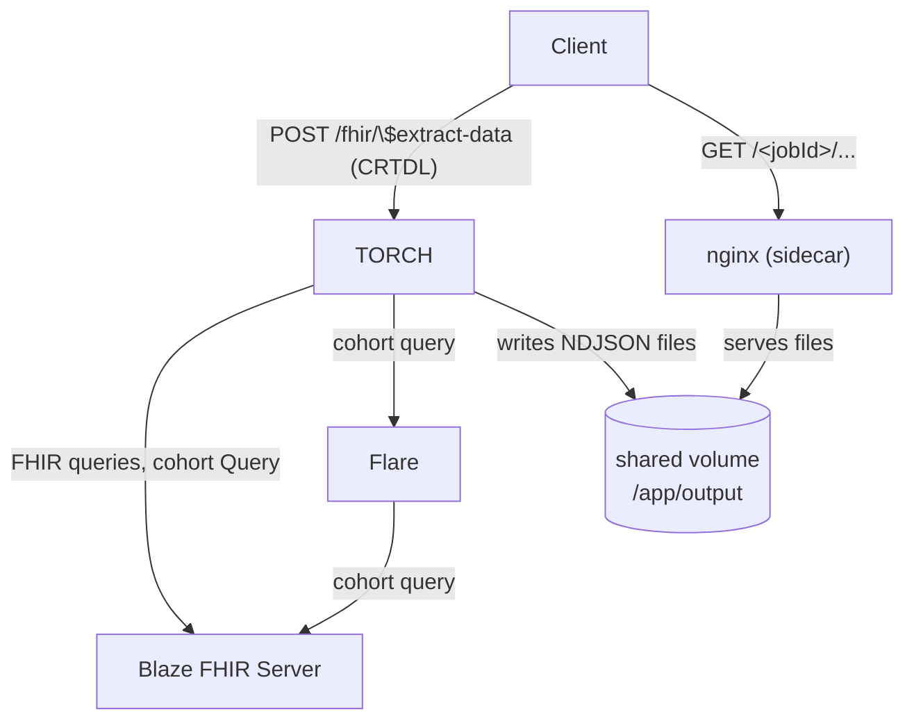

## Deployment

### Quickstart

**Self-contained local stack** — starts TORCH, Blaze, Flare, and the nginx file server together:

```sh
git clone https://github.com/medizininformatik-initiative/torch.git
cd torch
docker compose up
```


**Integration into an existing FHIR infrastructure** — the [MII data portal data-node](https://github.com/medizininformatik-initiative/dataportal/tree/main/data-node/torch) provides a leaner setup (TORCH + nginx only) with a pre-configured `.env.default` that points to your own FHIR server and Flare instance.

See [Configuration](configuration.md) for details on all configuration options.

### Install prerequisites

TORCH interacts with the following components:

- a CQL ready FHIR Server like [Blaze](https://github.com/samply/blaze)
  or [FLARE](https://github.com/medizininformatik-initiative/flare) for cohort retrieval
- A FHIR Server / FHIR Search API

TORCH writes extracted files to a local volume; a dedicated nginx **sidecar container** contained in the standard setup serves those files directly to clients without routing traffic back through the application. This decouples file delivery from extraction and allows the two concerns to be secured independently.

The diagram below shows the deployment topology:



### Feasibility Deploy

For simplicity torch is integrated in
the [feasibility-triangle](https://github.com/medizininformatik-initiative/feasibility-deploy/tree/main/feasibility-triangle)
of the feasibility-deploy repository, but can also be installed without it.

### Reverse Proxy Setup

TORCH writes extracted NDJSON output to a local directory (`TORCH_RESULTS_DIR`, default `/app/output`).
The nginx sidecar serves those files directly from the shared volume without any application-layer involvement.
Set `TORCH_DATA_VOLUME` to name the shared volume; the default is `torch-output`.

**Docker Compose (relevant excerpt):**

```yaml
services:
  torch:
    image: ghcr.io/medizininformatik-initiative/torch:latest
    env_file: .env
    ports:
      - "127.0.0.1:8086:8080"
    volumes:
      - "${TORCH_DATA_VOLUME:-torch-output}:/app/output"
    user: "1001:1001"

  torch-nginx:
    image: nginxinc/nginx-unprivileged:1.31.2-alpine
    ports:
      - "127.0.0.1:8085:8080"
    volumes:
      - "${TORCH_DATA_VOLUME:-torch-output}:/app/output"
      - ./nginx.conf.template:/etc/nginx/nginx.conf.template
      - ./start-nginx.sh:/start-nginx.sh
    entrypoint: ["/bin/sh", "/start-nginx.sh"]

volumes:
  torch-output:
```

Configure TORCH via a `.env` file. Key variables:

```env
# Connection
TORCH_BASE_URL=http://localhost:8086
TORCH_OUTPUT_FILE_SERVER_URL=http://localhost:8085
TORCH_FHIR_URL=http://fhir-server:8080/fhir
TORCH_FLARE_URL=http://torch-flare:8080

# Optional basic auth for the FHIR server
TORCH_FHIR_USER=
TORCH_FHIR_PASSWORD=

# Extraction
TORCH_BATCHSIZE=500
TORCH_MAXCONCURRENCY=4
TORCH_RESULTS_PERSISTENCE=PT12H30M5S

# Runtime
JAVA_TOOL_OPTIONS=-Xmx8g
LOG_LEVEL=info
```

`TORCH_OUTPUT_FILE_SERVER_URL` must match the address at which the nginx container is reachable by the client —
TORCH embeds this URL in the status response so callers know where to download result files.

**nginx startup (`start-nginx.sh`):**

```sh
#!/bin/sh
envsubst '${TORCH_SERVER_NAME}' < /etc/nginx/nginx.conf.template > /etc/nginx/nginx.conf
nginx -g 'daemon off;'
```

**nginx configuration (`nginx.conf.template`):**

```nginx
events {}
pid /tmp/nginx.pid;

http {
  server {
    listen 8080;
    server_name localhost;
    root /app/output;

    index index.html;

    location / {
      try_files $uri $uri/ =404;
      autoindex off;
    }

    access_log /var/log/nginx/access.log;
    error_log /var/log/nginx/error.log;

    error_page 404 /404.html;
    location = /404.html {
      internal;
    }
  }
}
```

::: warning Security
The file server has no authentication by default.
Bind the port to `127.0.0.1` (as shown above) and restrict access at the network or infrastructure layer —
for example through a site-level authenticating reverse proxy or mutual TLS termination in front of nginx.
Never expose the file server port directly on a public interface without additional access controls.
:::

A working reference implementation is provided in [`docker-compose.yml`](https://github.com/medizininformatik-initiative/torch/blob/main/docker-compose.yml), [`nginx.conf.template`](https://github.com/medizininformatik-initiative/torch/blob/main/nginx.conf.template), and [`start-nginx.sh`](https://github.com/medizininformatik-initiative/torch/blob/main/start-nginx.sh) in the repository root.

## Transfer Script

TORCH provides a companion [**transfer script
**](https://github.com/medizininformatik-initiative/torch/blob/main/scripts/transfer-extraction-to-dup-fhir-server.sh) designed to automate the workflow of submitting a data extraction
request, polling the status, and transferring the resulting files to a target FHIR server.

The transfer script will:

1. Take the **CRTDL** and generate a FHIR parameters resource to send to TORCH.
2. Execute the $extract-data operation on the TORCH server using the parameters resource as input.
3. Poll the TORCH status endpoint until the export is complete.
4. Download the resulting patient-oriented FHIR bundles into a temp dir.
5. Upload these files to a configured target FHIR server using the `blazectl` tool.
6. Provide progress feedback and error handling at each step.

## Verification

For container images, we use cosign to sign images. This allows users to confirm the image was built by the expected CI
pipeline and has not been modified after publication.

```
cosign verify "ghcr.io/medizininformatik-initiative/torch:v1.0.0-beta.6" \
--certificate-identity-regexp "https://github.com/medizininformatik-initiative/torch.*" \
--certificate-oidc-issuer "https://token.actions.githubusercontent.com" \
--certificate-github-workflow-ref="refs/tags/v1.0.0-beta.6" \
-o text
```

The expected output is:

```
Verification for ghcr.io/medizininformatik-initiative/torch:v1.0.0-beta.6 --
The following checks were performed on each of these signatures:
- The cosign claims were validated
- Existence of the claims in the transparency log was verified offline
- The code-signing certificate was verified using trusted certificate authority certificates
```

This output ensures that the image was build on the GitHub workflow on the repository
`medizininformatik-initiative/torch` and tag `v1.0.0-beta.6`.

