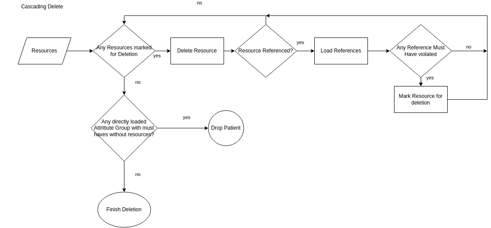

# Cascading Delete in Torch

Cascading delete is a critical feature for the Torch FHIR data extraction system that ensures referential integrity
and proper cleanup when resources are removed during the extraction process.
It is done in a queue based bidirectional manner, in the directions (parent → child) and (child → parent).

## Problem Context

In FHIR systems, resources often reference each other through various relationship types:

- **Patient → Observation, DiagnosticReport, Condition, etc.**
- **Encounter → Observation, Procedure, MedicationAdministration**
- **DiagnosticReport → Observation (results)**
- **Specimen → Observation (derived-from)**

When resources fail validation checks (such as must-have conditions, consent requirements, or profile compliance),
they need to be removed from the extraction batch.
However, simply removing a resource can break referential integrity and leave "orphaned" resources that reference the
deleted resource.

## Parent Child Relationships

a parent-child relationship in Torch is defined by the extraction process.
A parent resource is one that is extracted first and may have child resources that depend on it (i.e. a referential
chain).

- **Parent**: A resource that is referencing another reference.
- **Child**: A resource that is referenced by a parent resource, such as an Observation referencing a Patient or
  Encounter.

## Goal of Cascading Delete

Remove all resources whose referential chains are broken due to the deletion of a resource.

## Approach

1. **Identify Parent-Child Relationships**:
   During the extraction process, Torch identifies parent-child relationships based on the FHIR resource references in
   the reference resolve.
2. **Mark Resources for Deletion**:
   When a resource fails validation checks (consent,must-have), it is marked for deletion.
3. **Bi-directional Deletion**
    - **Parent to Child**:
        - If a parent resource is marked for deletion, all connections to its child resources are removed.
        - If a child has no other parent, it is also marked for deletion.
        - Directly loaded resources have a parent by default, so they are not deleted by this step.
    - **Child to Parent**:
    - If a child resource is marked for deletion, it removes its reference to the parent.
    - If the parent has no other children:
        - the reference has to be checked for must-have condition
        - if the parent has no other children and it was a must-have reference it is marked for deletion.
4. **Cleanup**:
    - After all resources are processed, Torch performs a cleanup step to remove all resources marked for deletion.
    - This ensures that no orphaned resources remain in the system.

