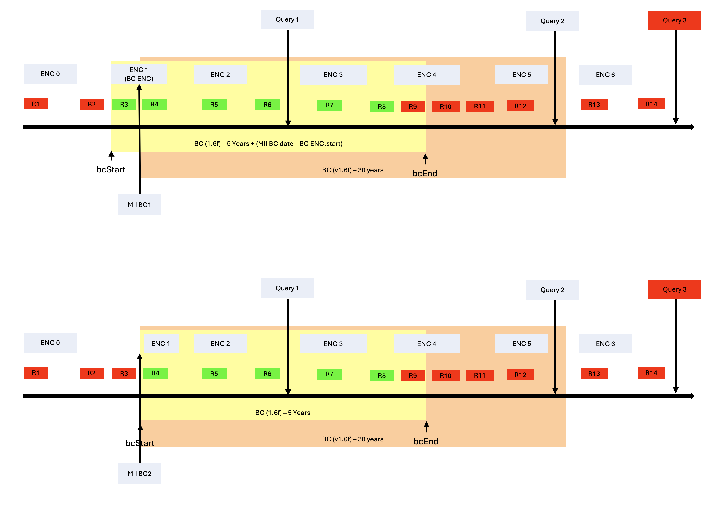

# Consent Handling in TORCH

TORCH implements **privacy-aware consent handling** to ensure that extracted data strictly complies with patient
permissions and applicable regulations.

---

## 1. Consent Representation

- TORCH supports the [FHIR Consent](https://www.hl7.org/fhir/consent.html) resource as the canonical way to represent
  patient consent.
- Consent records define:
    - **Who** has granted consent
    - **What** data may be accessed
    - **Purpose** and permitted actions
    - **Conditions** or time limits

---

## 2. Consent Evaluation

Before any data extraction:

1. TORCH retrieves a consent key from the CRTDL
   - 
2. For a batch all patient **Consent** resources are fetched from the FHIR server.
3. For the current extraction request the valid consent records are identified based on:
    - Patient ID
    - Status
    - Provision codes

4. Shift start of Consent by related Encounter if applicable:
    - The assumption is that consents are valid from the start of the encounters that have the start of the consent
      within
      their encounter period.
    -

5.During extraction TORCH determines:
    - Whether the requested resources are allowed according to the patient's consent.
    - If any resources are disallowed, they are excluded from the result set.

**PseudoCode for the implementation of the consent filter**

```

// THE ALGORITHM IS FOR EACH PATIENT => all consent and resources mentioned below are always for one patient

//Calculate BC start and end

bcEncounter =  -> find Encounter where Enc.start <= bc.date  and Enc.end >= bc.date    // note that the encounter for a BC is inferred through a date overlap and not a direct link
bcStart =  if bcEncounter -> bcEcnounter.start , else bc.Consent.provision.provision.period.start
bcEnd = bc.Consent.provision.provision.period.end   // note that this is usually bc.Consent.provision.provision.period.start + 5 years

// filter resources

for res in resourceListToBeExtracted:

    // Get resource times which are relevant for the consent calculation

    resConsentStart= if resEncounter -> resEncounter.period.start , else res.consentDate.start
    resConsentEnd = if resEncounter -> resEncouner.period.end, else res.consentDate.end

    // It is possible that resConsentStart = resConsentEnd, but this should not be a problem for the calculation


    if resConsentStart < bcStart:
        remove res
        // Applies to:  R1, R2      (MII BC1)
        // Applies to:  R1, R2, R3  (MII BC2)

    if resConsentEnd > bcEnd:
        remove res
        // Applies to:  R9, R10, R11, R12 (MII BC1)
        // Applies to:  R9, R10, R11, R12 (MII BC2)
```



## 3. Enforcement in Data Processing

- Disallowed data is **excluded** from the result set.
- All enforcement happens **before** results are packaged into NDJSON bundles.

---

## 4. Integration with CRTDL

- CRTDL definitions can reference consent rules directly via the consent key in the cohort selection.
- This allows **per-patient, per-resource** consent enforcement during structured extraction.

---

## 5. Limitations and Considerations

- Consent records must be **up-to-date** and accurately reflect patient permissions.
- Torch only supports the use of consent keys that are defined in the mapping configurations (
  see [Configuration](../configuration.md)).
- Consent check is defined only for certain fields of patient resources inside the patient compartment,
  i.e. only a specific time inside the Resource is checked and if none is defined the Resource is consenting by
  **default** (see the
  fields [type_to_consent.json](https://github.com/medizininformatik-initiative/torch/blob/main/mappings/type_to_consent.json)).

---
## Summary

Consent handling in TORCH is:

- **Standards-based** (FHIR Consent)
- Per Patient and per Resource
- Only checks specific fields of the patient compartment resource
