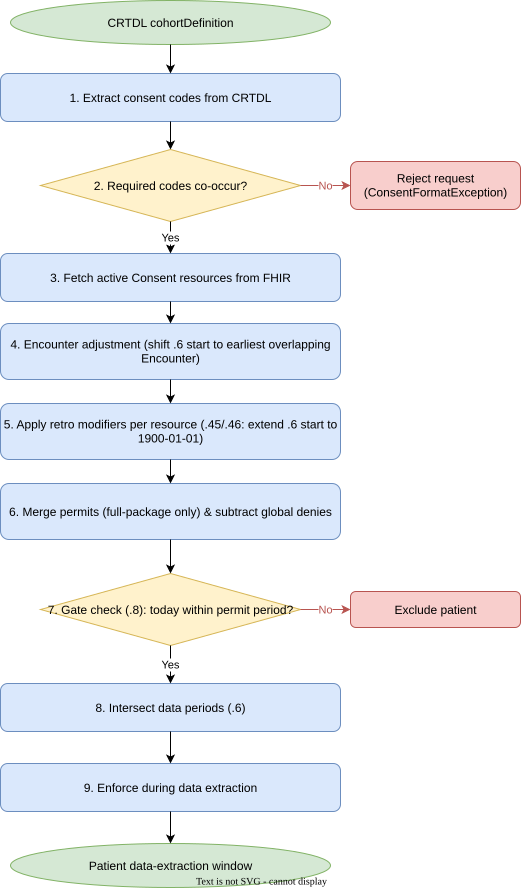
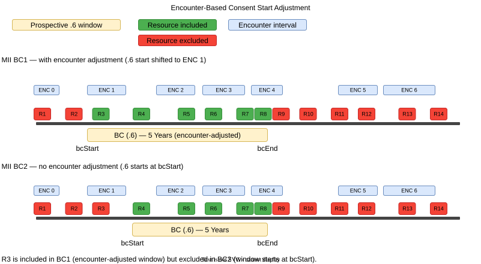
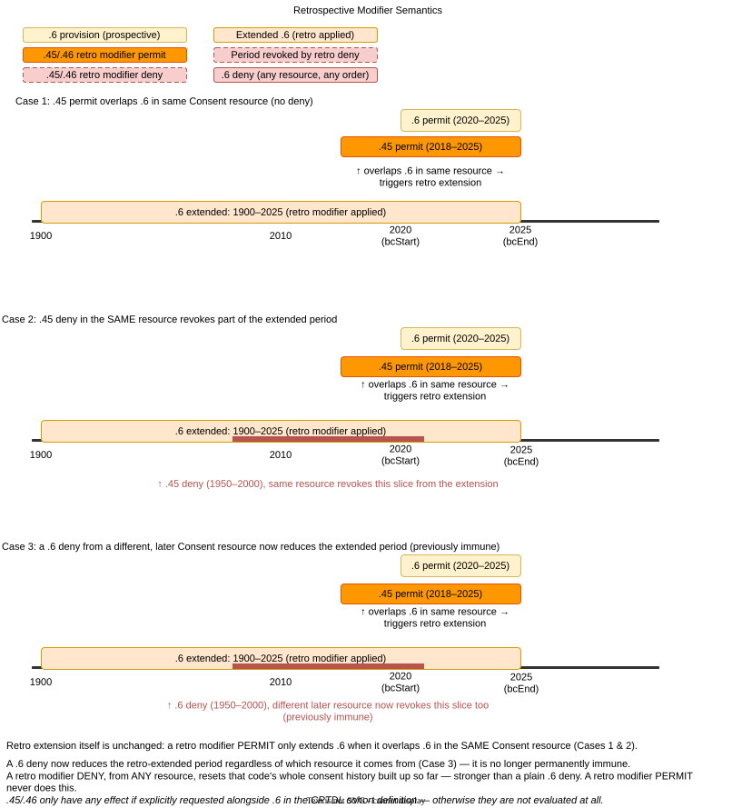
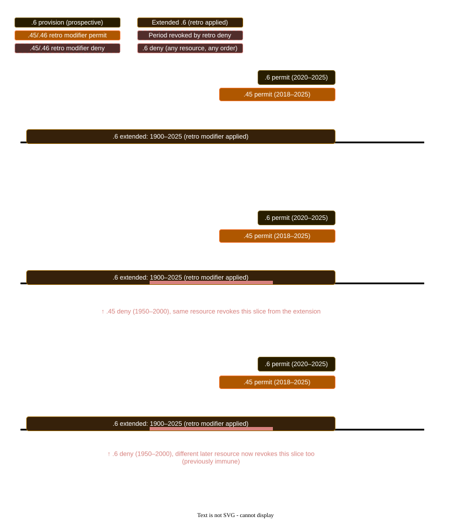

# Consent Handling in TORCH

TORCH implements **privacy-aware consent handling** to ensure that the extracted data strictly complies with patient
permissions and applicable regulations.

> **since v1.0.0-beta.1 — FDPG-Project consent scope clarified**
>
> As of this release, TORCH exclusively evaluates the two MII consent provision codes required for
> FDPG "Zentrale Analyse" (centralised data extraction for researchers):
>
> | Code | OID | Role |
> |---|---|---|
> | MDAT wissenschaftlich nutzen EU DSGVO NIVEAU | `2.16.840.1.113883.3.1937.777.24.5.3.8` | Validity gate — today must fall within the provision period |
> | MDAT erheben | `2.16.840.1.113883.3.1937.777.24.5.3.6` | Data-extraction window — resources outside this period are excluded |
>
> Both codes must appear **together** in the CRTDL cohort definition; TORCH rejects requests where
> only one is present. The optional retrospective modifiers (`.45` / `.46`) extend `.6`'s period back
> to 1900-01-01 when present in the same Consent resource and explicitly requested in the CRTDL.
>
> All other MII consent codes (BIOMAT, KKDAT, IDAT, etc.) are **silently ignored**.

---

## 1. Consent Representation

- TORCH supports the [FHIR Consent](https://www.hl7.org/fhir/consent.html) resource as the canonical way to represent
  patient consent.
- The MII broad consent model encodes each consented policy code as a sibling provision nested inside a single
  top-level deny provision. TORCH does not assume what real-world event a given Consent resource represents (an
  initial signing, a revocation, a recalculated consent, etc.) — it reads the permit and deny provisions directly
  and calculates the effective consent periods from them. A patient may have multiple Consent resources, each
  contributing its own provisions.
- Consent records define:
    - **Who** has granted consent
    - **What** data may be accessed
    - **Purpose** and permitted actions
    - **Conditions** or time limits

---

## 2. Supported Consent Codes

TORCH only processes consent provision codes listed in
[`mappings/consent-code-config.json`](https://github.com/medizininformatik-initiative/torch/blob/main/mappings/consent-code-config.json).
This file can be edited manually to adjust the supported codes for a deployment. The codes shipped with TORCH
represent the recommended MII default for FDPG-Project (Zentrale Analyse) use cases.

Each entry in the config describes a **prospective code** with:

| Field             | Meaning                                                                                                 |
|-------------------|---------------------------------------------------------------------------------------------------------|
| `validityGate`    | If `true`, today must fall within the patient's permitted period for this code — patient is excluded if not |
| `required`        | Other codes that must co-occur with this one in the CRTDL cohort definition                             |
| `retroModifiers`  | Optional modifier codes that extend this code's permitted period backwards to a fixed `lookbackDate`    |

**Shipped default:**

| Code                                                      | OID                                       | Role                                          |
|-----------------------------------------------------------|-------------------------------------------|-----------------------------------------------|
| MDAT wissenschaftlich nutzen EU DSGVO NIVEAU              | `2.16.840.1.113883.3.1937.777.24.5.3.8`   | Validity gate (today-in-period check)         |
| MDAT erheben                                              | `2.16.840.1.113883.3.1937.777.24.5.3.6`   | Data-extraction window                        |
| MDAT retrospektiv speichern, verarbeiten                  | `2.16.840.1.113883.3.1937.777.24.5.3.45`  | Retrospective modifier for `.6` (optional)    |
| MDAT retrospektiv wissenschaftlich nutzen EU DSGVO NIVEAU | `2.16.840.1.113883.3.1937.777.24.5.3.46`  | Retrospective modifier for `.6` (optional)    |

`.8` and `.6` are declared as mutually required — both must appear together in the CRTDL cohort definition.
The retrospective modifiers `.45` and `.46` are optional and only take effect if they are also explicitly included
in the CRTDL cohort definition — being listed in `consent-code-config.json` is not sufficient on its own.
Codes not listed in `consent-code-config.json` are silently ignored.

---

## 3. Consent Evaluation Pipeline




Before any data extraction:

1. **Extract consent codes from CRTDL** — codes are read from the `cohortDefinition` inclusion criteria. TORCH
   extracts only the provision codes that are present and ignores their Boolean combination (AND/OR).
2. **Validate co-occurrence** — for every supported code present, all codes listed in its `required` field must also
   be present. If `.6` appears without `.8` (or vice-versa), the request is rejected with a `ConsentFormatException`.
3. **Filter to supported codes** — only prospective codes defined in `consent-code-config.json` are retained.
4. **Fetch from FHIR** — **Active** Consent resources are fetched for the supported codes, plus any retro modifier codes
   that were explicitly requested in the CRTDL.
5. **Adjust by Encounter** — for data-period codes (non-gate codes, i.e. `.6`), the start of each permitted provision
   is shifted to the start of the earliest overlapping Encounter if that Encounter start is earlier. Encounters
   without both a start and end date are ignored i.e. an open-ended (ongoing) encounter cannot anchor the shift. Gate
   codes (`.8`) are never encounter-adjusted by design. This step can be turned off entirely via
   `TORCH_ENABLE_ENCOUNTER_SHIFT` (default `true`); when disabled, no Encounter search is performed and provisions
   are used as fetched.
6. **Order and merge, code by code** — Consent resources are processed in ascending `dateTime` order (ties broken
   by resource id, purely for determinism — id carries no clinical meaning). For each supported code, each
   resource's own permit period — only if that resource alone carries permits for **all** required codes (`.6`
   AND `.8`) — and each resource's deny of that code are folded into a running period, one resource at a time, in
   that order. A permit is *merged* into whatever was accumulated so far, so a later permit can reinstate a
   period an earlier deny had removed; a deny is *subtracted* from the running total. Revocation documents that
   carry only a deny still count, from any resource, in the order their `dateTime` places them.
7. **Apply retrospective modifiers** — only for modifier codes (`.45`/`.46`) explicitly requested in the CRTDL
   cohort definition (see step 4), evaluated as part of step 6 while each resource is folded in:
   - If a resource's own permitted `.6` provision overlaps in time with a permitted retro modifier provision
     **in the same resource**, that resource's contribution is extended back to `1900-01-01`. A retro modifier
     deny in the *same* resource subtracts from that extension before it is added — it never reduces the plain
     `.6` permit period itself.
   - If a resource carries a retro modifier **deny** for the code — regardless of period overlap, and whether or
     not it also carries a `.6` permit of its own — that resource's contribution **replaces** the running total
     built up so far instead of merging into it. A single revocation of retrospective consent can therefore
     invalidate everything accumulated for that code up to that point, including permits from earlier, otherwise
     unrelated resources.
   - A retro modifier **permit** never has this replacing effect, even standing alone in its own resource: a
     grant must never leave a patient worse off than if the resource had not been sent at all. A `.45`/`.46`
     permit with no `.6` permit in the same resource simply contributes nothing.
8. **Gate check** — for each validity-gate code (`.8`), today must fall within the final merged period. If the
   check fails for any gate code the patient is excluded from the result.
9. **Intersect data periods** — the allowed periods of all data-period codes (`.6`) are intersected to produce the
   patient's final data-extraction window.
10. **Enforce during extraction** — resources whose consent data field (as configured in `type_to_consent.json`)
    falls outside the consent window are excluded from the result.

Consent resources without a `dateTime` element are skipped during fetch and never reach this pipeline (step 4) —
step 6 requires every resource it processes to carry one, since ordering now determines the result.

### Encounter Adjustment

The diagram below shows two patients — **MII BC1** (encounter adjustment applied) and **MII BC2** (no adjustment)
— to illustrate how step 5 shifts the `.6` provision start.




In BC1, the `.6` window is extended back to the start of the overlapping encounter (ENC 1), making an additional
historical resource (R3) eligible for extraction compared to BC2 where the window starts at `bcStart`.

---

## 4. Validity Gate vs. Data-Extraction Window

`.8` (MDAT wissenschaftlich nutzen EU DSGVO NIVEAU) and `.6` (MDAT erheben) play distinct roles:

| Code | Role             | What it controls                                                          |
|------|------------------|---------------------------------------------------------------------------|
| `.8` | Validity gate    | Is the patient's consent currently active? Today must be within the period. |
| `.6` | Data window      | How far back in time may data be extracted?                               |

Both must be present in the CRTDL. If `.8` fails the gate check (e.g. the patient's consent has expired) the
patient is excluded entirely — `.6` is not evaluated.

Both codes' periods are taken at face value from the Consent resource — TORCH does not derive or validate them.
For the MII broad consent, `.8` is expected to span the signing day to signing day + 30 years, and `.6` the
signing day to signing day + 5 years.

---

## 5. Retrospective Modifier Semantics

The retrospective modifiers (`.45`, `.46`) act as **period extenders** for `.6`, and a retro modifier deny acts
as a **history reset** — these are two distinct mechanisms:

**Extension (retro modifier permit):**

- A modifier is only applied if it was explicitly requested in the CRTDL.
- A modifier extends `.6` only when a permitted instance of it appears in the **same Consent resource** as the
  `.6` provision it extends, and their periods **overlap within that resource**. A `.45` permit in resource B
  does **not** extend a `.6` permit in resource A.
- When applied, the resource's contribution for `.6` is extended back to `1900-01-01`.
- A retro modifier deny in the *same* resource subtracts from that extension before it is added.
- If a patient has no permitted `.6` provision in the same resource as the modifier, the modifier permit
  contributes nothing — it does **not** affect any other resource's `.6` permit, past or future.

**Reset (retro modifier deny):**

- A retro modifier deny — for a code with retro modifiers configured and explicitly requested in the CRTDL —
  discards everything accumulated for that code from resources processed before it (see pipeline step 6/7),
  regardless of whether its period overlaps anything and regardless of whether the same resource also carries a
  `.6` permit. This is intentionally stronger than a plain `.6` deny: revoking retrospective consent is treated
  as invalidating the whole retrospective picture for that code, not just the time window the revocation names.
- Because resources are processed in `dateTime` order, only retro modifier denies from resources **at or before**
  the point being calculated matter — a later `.6` permit (in a still-later resource) can re-establish the
  period from scratch.
- Prospective code **denies** (`.6` deny) reduce whatever is currently accumulated for `.6` — including a
  retro-extended period — regardless of which resource granted it. They do not trigger the reset above; only a
  retro modifier deny does.

The diagram below shows the two key cases — with and without a retro modifier deny.




<style>
.diagram-light, .diagram-dark { max-width: 100%; }
html:not(.dark) .diagram-dark { display: none; }
html.dark .diagram-light { display: none; }
</style>

**Example:**

```
Consent resource A (dateTime 2020-01-01):
  .8  2020–2050  permit
  .6  2020–2025  permit
  .45 2020–2025  permit   ← same resource, overlaps .6 → extends .6 to [1900-01-01, 2025-12-31]
  .45 2000–2009  deny     ← same resource, subtracts [2000-01-01, 2009-12-31] from that extension
  → running .6 total after A: [1900-01-01, 1999-12-31] ∪ [2010-01-01, 2025-12-31]

Consent resource B (dateTime 2023-01-01, revocation):
  .6  2023–2025  deny     ← subtracts from the running total, including the retro-extended part
  → running .6 total after B: [1900-01-01, 1999-12-31] ∪ [2010-01-01, 2022-12-31]

Consent resource C (dateTime 2024-01-01, a later addendum):
  .45 2024–2028  permit   ← no .6 permit in this resource, and it's a permit not a deny → no effect
  → running .6 total after C: unchanged

Consent resource D (dateTime 2025-01-01, revocation of retrospective consent):
  .45 2025–2028  deny     ← retro modifier deny, no period overlap with anything above → resets .6
  → running .6 total after D: empty (D carries no .6 permit of its own to rebuild from)
```

---

## 6. Enforcement in Data Processing

Consent is enforced at two points in the extraction pipeline — both before results are packaged into NDJSON bundles:

- **Direct load** — when patient resources are fetched from the FHIR server, each resource is checked against the patient's consent window. Resources outside the window are dropped before any further processing.
- **Reference resolution** — when referenced resources are fetched and assigned to a patient bundle, the same consent window check is applied. Resources outside the window are excluded from the bundle.

Core resources (resources outside the patient compartment) are not consent-filtered.

---

## 7. Integration with CRTDL

Consent codes are embedded in the `cohortDefinition` as inclusion criteria entries with `context.code = "Einwilligung"`. Each entry carries one MII OID provision code in `termCodes`. When at least one such entry is present, TORCH enables consent enforcement for the entire extraction job. If no `Einwilligung` entries are present, consent enforcement is skipped and all resources are treated as consented.

```json
{
  "inclusionCriteria": [
    [
      {
        "context": {
          "code": "Einwilligung",
          "display": "Einwilligung",
          "system": "fdpg.mii.cds",
          "version": "1.0.0"
        },
        "termCodes": [
          {
            "code": "2.16.840.1.113883.3.1937.777.24.5.3.8",
            "display": "MDAT wissenschaftlich nutzen EU DSGVO NIVEAU",
            "system": "urn:oid:2.16.840.1.113883.3.1937.777.24.5.3",
            "version": "1.0.7"
          }
        ]
      }
    ],
    [
      {
        "context": {
          "code": "Einwilligung",
          "display": "Einwilligung",
          "system": "fdpg.mii.cds",
          "version": "1.0.0"
        },
        "termCodes": [
          {
            "code": "2.16.840.1.113883.3.1937.777.24.5.3.6",
            "display": "MDAT erheben",
            "system": "urn:oid:2.16.840.1.113883.3.1937.777.24.5.3",
            "version": "1.0.7"
          }
        ]
      }
    ]
  ]
}
```

To additionally request the retrospective modifiers `.45`/`.46` for a patient, include them alongside `.6` in the
cohort definition. TORCH ignores the Boolean grouping of inclusion criteria (see pipeline step 1) and only extracts
the individual codes present — the retro modifiers only take effect when included like this in the CRTDL (see
sections 2 and 5):

```json
{
  "inclusionCriteria": [
    [
      {
        "termCodes": [
          {
            "code": "2.16.840.1.113883.3.1937.777.24.5.3.8",
            "display": "MDAT wissenschaftlich nutzen EU DSGVO NIVEAU",
            "system": "urn:oid:2.16.840.1.113883.3.1937.777.24.5.3",
            "version": "1.0.7"
          }
        ],
        "context": {
          "code": "Einwilligung",
          "display": "Einwilligung",
          "system": "fdpg.mii.cds",
          "version": "1.0.0"
        }
      }
    ],
    [
      {
        "termCodes": [
          {
            "code": "2.16.840.1.113883.3.1937.777.24.5.3.6",
            "display": "MDAT erheben",
            "system": "urn:oid:2.16.840.1.113883.3.1937.777.24.5.3",
            "version": "1.0.7"
          }
        ],
        "context": {
          "code": "Einwilligung",
          "display": "Einwilligung",
          "system": "fdpg.mii.cds",
          "version": "1.0.0"
        }
      },
      {
        "termCodes": [
          {
            "code": "2.16.840.1.113883.3.1937.777.24.5.3.46",
            "display": "MDAT retrospektiv wissenschaftlich nutzen EU DSGVO NIVEAU",
            "system": "urn:oid:2.16.840.1.113883.3.1937.777.24.5.3",
            "version": "1.0.7"
          }
        ],
        "context": {
          "code": "Einwilligung",
          "display": "Einwilligung",
          "system": "fdpg.mii.cds",
          "version": "1.0.0"
        }
      },
      {
        "termCodes": [
          {
            "code": "2.16.840.1.113883.3.1937.777.24.5.3.45",
            "display": "MDAT retrospektiv speichern verarbeiten",
            "system": "urn:oid:2.16.840.1.113883.3.1937.777.24.5.3",
            "version": "1.0.7"
          }
        ],
        "context": {
          "code": "Einwilligung",
          "display": "Einwilligung",
          "system": "fdpg.mii.cds",
          "version": "1.0.0"
        }
      }
    ]
  ]
}
```

The consent check uses a specific date field per FHIR resource type to determine whether a resource falls within the patient's consent window. If no field is configured for a resource type, all resources of that type are considered consented (see [type_to_consent.json](https://github.com/medizininformatik-initiative/torch/blob/main/mappings/type_to_consent.json)).

---

## 8. Limitations and Considerations

- Within a single consent block in the cohort definition (CCDL), TORCH extracts the individual consent provision
  codes and ignores their Boolean combination — the co-occurrence and period logic described above is applied instead.
- Consent records must be **up-to-date** and accurately reflect patient permissions.
- Only the codes listed in `consent-code-config.json` are evaluated — all others are ignored.
- The shipped default config supports the MII FDPG-Project (Zentrale Analyse) consent codes; other use cases may
  are currently not supported.
- TORCH treats all data in the FHIR server as MDAT (Medizinische Daten).
- TORCH does not consider consent versioning — provision codes are assumed to be unique and to retain the same
  meaning across all versions of the consent profile.

---

## Summary

Consent handling in TORCH is:

- **Standards-based** (FHIR Consent, MII KDS profile, MII broad consent structure)
- Per-patient, order-sensitive: Consent resources are folded in ascending `dateTime` order; permits only count from resources that carry the complete required package (`.6` AND `.8`); a later permit can reinstate a period an earlier deny removed. Retro modifier extension stays scoped to the resource it appears in, but a retro modifier **deny** resets a code's whole accumulated history, from any resource
- Driven by `consent-code-config.json` — no code changes required for new consent codes that follow the same
  combination logic as the default set. **This is a fundamental limitation:** TORCH can only handle the validity-gate
    + data-window + retrospective-modifier model hardcoded in its pipeline. New codes that require different combination
      semantics (e.g. a different gate structure, alternative period logic, or additional provision types) cannot be
      supported through configuration alone and require code changes.
