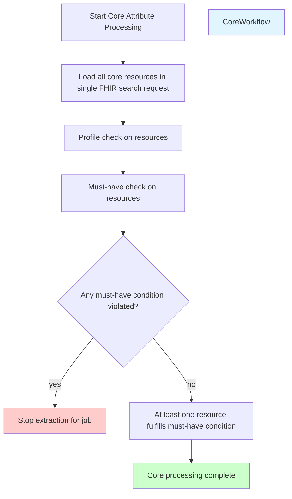
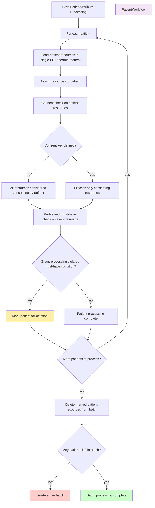

# Handling Attribute Groups Directly

TORCH distinguishes between directly loaded and referenced attributeGroups, where referenced attributeGroups are identified by the flag
`IncludeReferenceOnly`.
Directly loaded attributeGroups can be loaded directly as their inclusion in the extraction does not depend on any referencing.

TORCH loads all resources of the directly loaded attributeGroups based on the Fhir Profile specified in the attribute group and the filters applied to the attribute group.
I.e. resources are loaded based on the Fhir Profile specified in the attribute group and
the [filters](../crtdl/filter.md) applied to
the attribute group.

The processing has two separate workflows due to the different nature of the resources:

1. **Core Resources**: These are resources that are outside the patient compartment (no direct link to Patient - e.g. Medication).
2. **Patient Resources**: These are resources that are directly loaded and processed for each patient.

## 1. Directly Loaded Core Attribute Groups

Core attributes are simply loaded and processed in a single step.

This means that all resources that are part of the core attribute group are loaded and processed in a single fhir search
request.

- After that a profile and must-have check is done on the resources.
    - Must-have conditions are violated if **not a single** resource passes this check.
- If any **must-have** condition is violated, the extraction is fully stopped for the job.
- At the same time it is sufficient if the must-have conditions are fulfilled for a single "global" resource.

## 2. Directly Loaded Patient Attribute Groups

Patient attribute groups are loaded and processed for each patient.

All resources from a patient attribute group are loaded and processed in a single fhir search request
and then assigned to their patient.

- First the consent is checked for each of the loaded resources and only resources that pass the consent check are processed further.
    - When **no consent** key is defined, all resources are considered to be consenting by
      default.
- A profile and must-have check is done on every resource.

- If after the group processing a must-have condition is violated, the respective patient is marked for deletion. Once all patients are processed,
  all resources (including the patient resource itself) for a patient marked for deletion are deleted. If no resources are left the whole batch is deleted.

