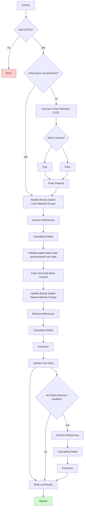

## Implementation Overview

#### Pipeline Overview

The TORCH pipeline consists of several key components that work together to extract and process data from FHIR servers
based on the Clinical Resource Transfer Definition Language (CRTDL). The main components of the pipeline are:

- **CRTDL Definition**: A JSON-based definition that specifies the cohort and data extraction rules.
- **Cohort Selection**: Uses FHIR Search or CQL to identify the population
- **Data Extraction**: Extracts FHIR resources based on the CRTDL definition.
- **Consent Handling**: Applies consent rules to ensure compliance with privacy regulations.
- **Output Generation**: Produces FHIR-compliant resources in NDJSON format.

#### Pipeline Steps

1. **Validate CRTDL Definition**: Ensure the CRTDL definition is correctly formatted and contains valid criteria.
2. **Cohort Evaluation**: Evaluate the cohort via FHIR Search or CQL, unless patient IDs passed directly as parameter.
3. **Preprocessing of directly loaded core Resources
   **: Directly loaded core resources are processed first, as to ensure the results can be shared over all patients.
4. **Handling Patient Resources
   **: For each patient, the pipeline processes the resources according to the CRTDL definition.
5. **Handling Core Resources**: Patients can load new core resources, which are then postprocessed.
6. **Writing Output**: The final output is written in NDJSON format, with each patient’s data in a separate bundle.

