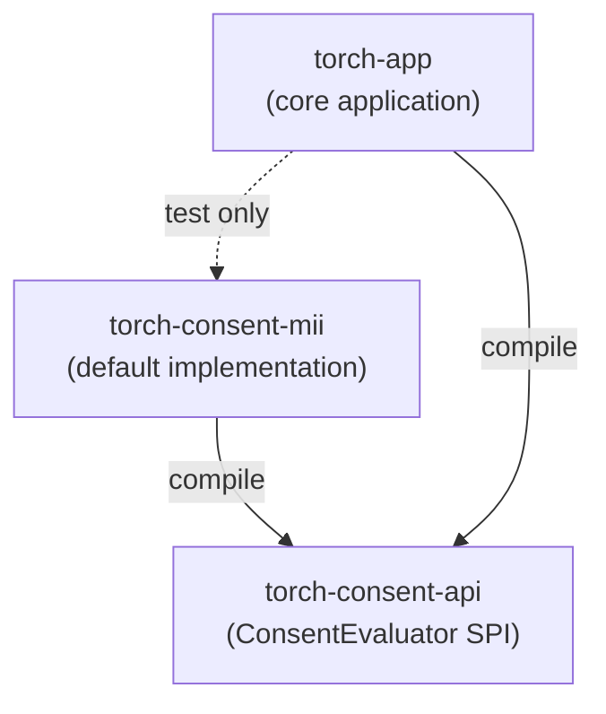

# Project Modules

TORCH is built as a Maven multi-module reactor. This split exists primarily to make consent handling swappable
(see [Custom Consent Modules](custom-consent-modules.md)) without forking or
rebuilding the core application — the module boundary is what makes `torch-consent-mii` a genuinely separate,
replaceable deployment artifact rather than just an internal package.



## Modules

| Module | Packaging | Depends on | Purpose |
|---|---|---|---|
| `torch-parent` | `pom` (root aggregator) | — | Declares the module list, shared dependency versions (`dependencyManagement`), and shared plugin configuration (`pluginManagement`). Not itself compiled or tested. |
| `torch-consent-api` | `jar` | — | The `ConsentEvaluator` extension point: `ConsentEvaluator`, `ConsentContext`, `PatientSet`, `ConsentDataClient`, plus consent-period value types (`Period`, `NonContinuousPeriod`). No MII-specific logic. |
| `torch-consent-mii` | `jar` | `torch-consent-api` | The default `ConsentEvaluator` implementation — the MII Broad Consent pipeline documented in [Consent Handling](consent.md). Registered via Spring Boot's auto-configuration SPI (`META-INF/spring/org.springframework.boot.autoconfigure.AutoConfiguration.imports`), not `@Component` scanning, so implementations outside TORCH's own packages are discovered the same way. Packaged as its own jar and shipped separately from the main application jar. |
| `torch-app` | `jar` (Spring Boot fat jar) | `torch-consent-api` (compile), `torch-consent-mii` (**test only**) | The core application: REST API, job scheduling, extraction pipeline, cohort query. Depends on `torch-consent-mii` only so its own integration tests have a real `ConsentEvaluator` bean available — the production image does not bundle `torch-consent-mii` inside `torch.jar`; it is copied in as a separate file (see below). |

`torch-app`'s dependency on `torch-consent-mii` being test-scoped is the detail that keeps the default swappable:
if it were a compile/runtime dependency, `torch-consent-mii` would be baked into the fat jar and the plugin
mechanism below would have nothing to swap.

## How the swap works at runtime

`torch-app`'s Docker image copies `torch-consent-mii`'s jar into `/app/plugins/` as a separate file rather than
including it in `torch.jar`. The application is launched via Spring Boot's `PropertiesLauncher` with
`-Dloader.path=$LOADER_PATH` (`docker-entrypoint.sh`, `LOADER_PATH` default `/app/plugins`), which adds every jar
in that directory to the classpath at startup, on top of what's already bundled in `torch.jar`. Replacing the jar
in that directory and restarting the container is enough to swap the active `ConsentEvaluator` — no TORCH rebuild
required. Full walkthrough, including how to implement a replacement: [Custom Consent Modules](custom-consent-modules.md).

## Building and testing per module

```bash
# Full reactor build / test (from the repo root)
mvn -P download-ontology -B package -DskipTests
mvn -P download-ontology -B verify

# A single module and the modules it depends on
mvn -pl torch-consent-api -am compile
mvn -pl torch-consent-mii -am test

# torch-app specifically (needs torch-consent-api/torch-consent-mii installed or built alongside)
mvn -pl torch-app -am test
```

The `download-ontology` profile (fetches `ontology/` content used by `torch-app` at runtime and in its tests) is
declared on `torch-app`'s POM; activating it with `-P download-ontology` from the reactor root still applies it
correctly when building `torch-app`, since Maven profile activation is a reactor-wide flag, not per-module.

`torch-consent-api` and `torch-consent-mii` have no such profile — they carry no MII-runtime-data dependency beyond
`torch-consent-mii`'s bundled `consent-code-config.json` classpath resource.
