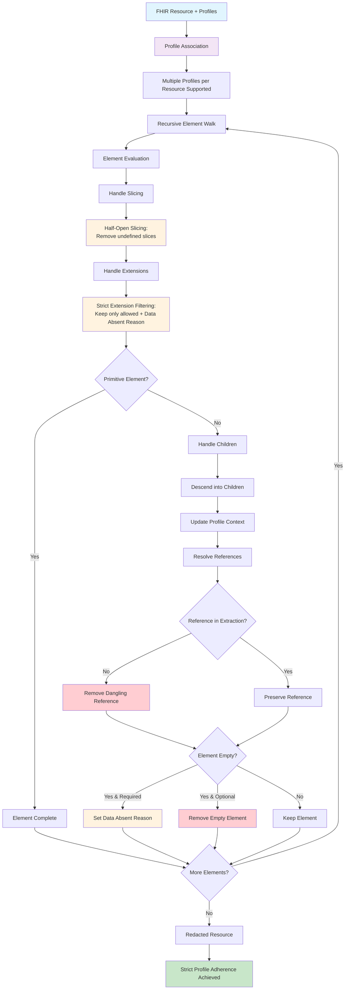

# Redaction

Torch redacts resources after extracting the specified attributes and resolving references before packaging them into
NDJSON bundles.

The redaction ensures that not only the requested information is included in the output, but also that any
unnecessary data is removed according to predefined rules.

During the reference resolve and loading of resources a resource is associated with all profiles that were used to
extract it.

## 1. Redaction Rules

- **Strict Structure Definition Adherence**: Resources are redacted to strictly adhere to the structure defined in the
  requested profiles.
  That means for example if a profile only allows a subset of address fields, all other fields are removed from the
  output.
- **Strict Extension Handling**: Only extensions explicitly allowed in the profile are retained. All other extensions
  except for Data Absent Reason are removed.

- **Reference Handling**: References to other resources are preserved if they were part of the reference resolve
  process.
  References to resources not included in the extraction are removed to prevent dangling references.

- **Empty Element Removal**: Elements that become empty after redaction are removed from the resource to maintain a
  clean structure.

- **"Half-Open" Slicing**: With the strict structure definition adherence, Torch implements a "half-open" slicing
  approach.
  This means that if slicing is open in the profile, additional slices not defined in the profile are removed.
  Exception is with multiple profiles per resource, where the first known profile is selected greedily.

- **Data Absent Reason Setting**: If an element is removed due to redaction or extraction but is required by the
  profile,
  it is replaced with a Data Absent Reason extension to indicate that the data was intentionally omitted.

## 2. Redaction Process

Recursive Walk through Resource:

1. **Profile Identification**: Determine the profile(s) associated with the resource to understand the structure and
   allowed elements.
   Associate the resource with the all profiles associated with it during the extraction process.
   **multiple profiles per resource are supported** the context for the profiles (i.e. the element id in the structure
   definition) is tracked in parallel for all profiles.

2. **Element Evaluation**: For each element in the resource, evaluate whether it is allowed by the profile.
    1. Handle Slicing
    2. Handle Extensions
    3. (if not primitive) Handle Children

3. Handling Children
    1. descend into children (update context for profiles)
   2. resolve references (remove references to resources not identified during reference resolve)
    3. if empty set Data Absent Reason if required by any profile

## 3. Limitations and Considerations

- **Profile Accuracy**: The effectiveness of redaction relies heavily on the accuracy and completeness of the profiles
  used.
  Incomplete profiles may lead to unintended data retention or removal.

- **Value Sets Binding Slices**: Since TORCH does not have its own terminology service, value sets binding slices are
  not fully supported.
  This means that if a slice is defined based on a value set, TORCH cannot enforce the inclusion or exclusion of
  elements based on that value set and
  only support the structural definition of the slice with the code system.

- **No slicing Rules**: Torch does not support slicing rules like "open" or "closed" in the profiles.
  It implements a "half-open" approach where additional slices not defined in the profile are removed, except when
  multiple profiles per resource are used.

- **No Slicing Ordering**: Torch does not enforce any specific ordering of slices or elements within the resource.
  That means that it does not check if the order of elements in the resource matches the order defined in the profile.

## 4. Summary

Torch's redaction process is designed to ensure that extracted resources strictly adhere to the defined profiles,
removing any unnecessary or disallowed data while preserving essential references and structure.    

