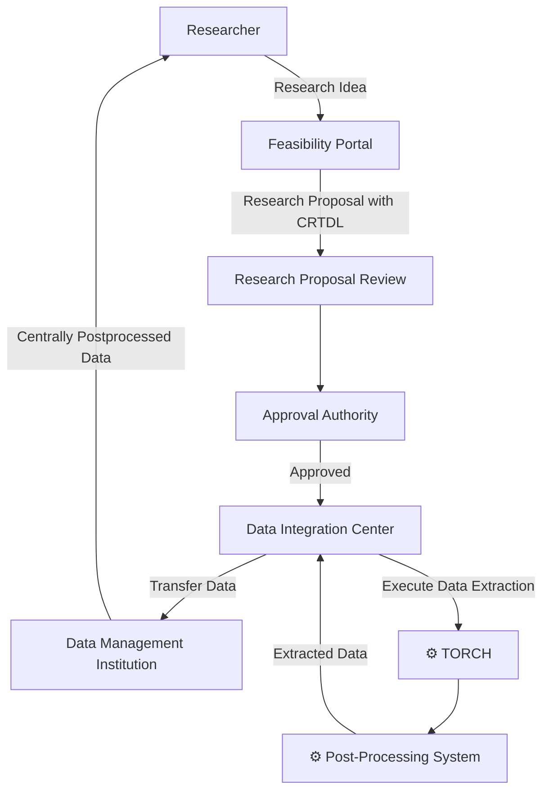

# TORCH - Transfer Of Resources in Clinical Healthcare

## Goal

**T**ransfer **O**f **R**esources in **C**linical **H**ealthcare or **Torch** is a project that aims to provide
a service that allows the local execution of structured data extraction queries on a FHIR-server.

The main goal of TORCH is to automate the extraction of structured clinical data from FHIR servers as defined by
a well defined query language the so called [Clinical Resource Transfer Definition Language (CRTDL)](crtdl/crtdl.md) .

This is vital inside clinical research networks, where data from multiple institutions needs to be aggregated for centralized and decentralized analysis.

Manual extraction and transformation of data is time-consuming and error-prone, especially in a decentralized scenario.

TORCH aims to solve this problem by providing a tool that can extract data based on a well-defined
**human-readable** structure and apply consent rules to ensure consent compliance.
This structure can then be used to extract data from multiple institutions in a consistent manner.

A exemplary use case based on the [German Medical Informatics Initiative (MII)](https://www.medizininformatik-initiative.de/en/), where TORCH is used to extract data from hospital FHIR servers for a centralized analysis based on the
[Clinical Resource Transfer Definition Language (CRTDL)](crtdl/crtdl.md) is shown below:

## Features

TORCH provides a range of features to support standardized and consent-aware data extraction:

- **Required Fields Validation**:
  Ensures that mandatory fields defined in the CRTDL are present in the extracted resources.
- **Consent Handling**: Applies consent rules as defined in the CRTDL to guarantee compliance during data extraction.
- **Reference Resolution**:
  Resolves references between resources while maintaining referential integrity.
- **Slicing and Extensions**: Supports slicing and FHIR extensions to handle institution-specific resource structures.
- **Profile Adherence**:
  Only keeps elements from extracted resources as specified by specific FHIR profiles (see [Redaction](implementation/redaction)).
- **FHIR Bulk Data Access**:
  Implements the [FHIR Bulk Data Access](api/api.md) specification for efficient large-scale data extraction.
- **FHIR-to-FHIR Transfer**:
  Creates extracted data in a FHIR-compliant format ready for import into another FHIR server or further FHIR based processing - ensuring maximum interoperability.

## Limitations

- **Value Sets Binding Slices**:
  Since TORCH does not have its own terminology service, it does not support slicing by value set bindings.
- **FHIR Version Support**: TORCH currently supports only
  **FHIR R4**. Other versions (e.g., DSTU2, R5) are not supported.
- **On the fly profile support**: TORCH only supports a
  **set of FHIR profiles** 
given at program startup via config by mounting all valid Structure Definitions (see [Configuration](configuration.md)).
- **Nested Resources**: TORCH does not handle
  **deeply nested resources**; they are currently treated as a single field rather than fully resolved structures.
- **Performance Constraints**: Large-scale extraction is bound by the
  **FHIR Bulk Data Access specification** and server capabilities;
  performance may vary depending on server implementation.
- **Consent Complexity**: Consent handling is limited to
  **rule-based approaches defined in the CRTDL**. Complex or non-standard consent models may require customization.
- **Interoperability**: TORCH ensures FHIR compliance but does not guarantee interoperability with
  **all vendor-specific FHIR implementations**.

## License

TORCH is licensed under the Apache License, Version 2.0. See the [LICENSE](https://github.com/medizininformatik-initiative/torch/tree/main/LICENSE) file for details.

